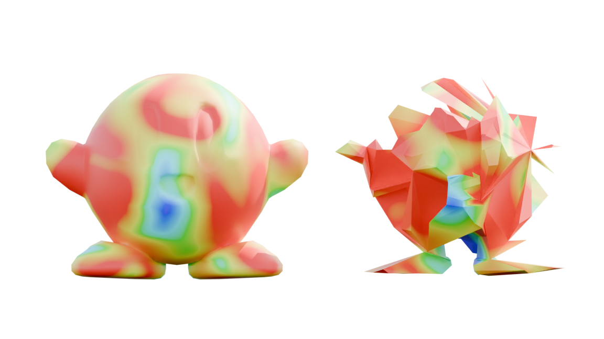

# KirbyNet

You'll find here a failed experiment in trying to use [MeshCNN]() for mesh smoothing purposes by changing the objective function to output feature uniformity, with the intuition that maybe th epooling operations would contain or encode a mesh surface's high frequency data.

Pretty bold assumption, as it unsurprisingly does not work. Look what it did to poor Kirby.

I have a feeling tis doesn't work because the deeper the network goes, the less that feature values are disconnected from geometrical meaning.
Keeping this on here because I hope I'm wrong.